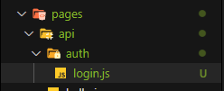
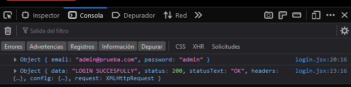
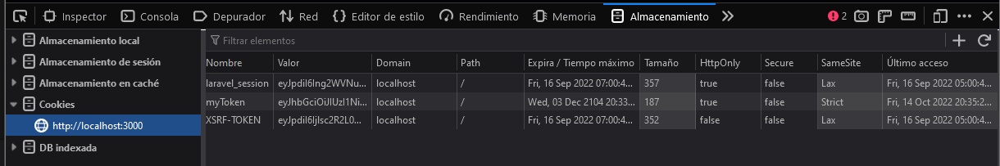
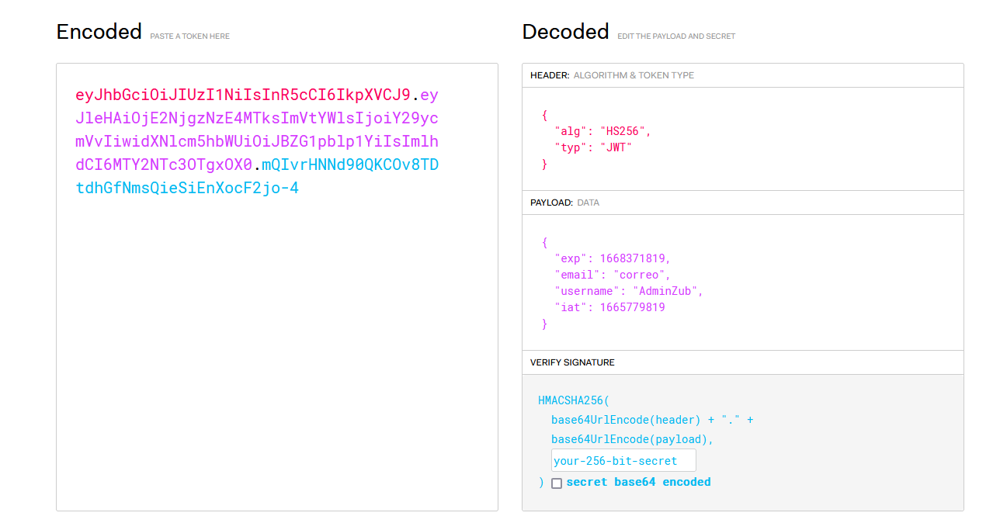
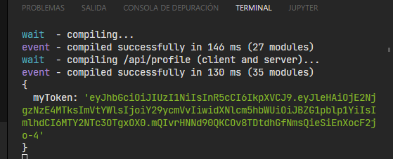
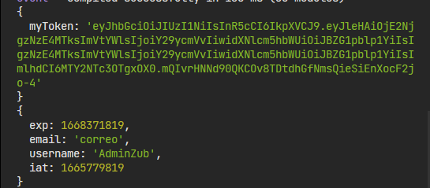

```npx create-next-app next-login-app```

```npm run dev```

--- 

## **Backend**

Usar la carpeta api de next



```npm i axios```

```js
const response = await axios.post('/api/auth/login',credentials);
```

Desde el back, api/auth/login

```js
export default function loginHandler(req,res){
    const {email,password} = req.body;
    return res.json('login route')
}
```
---

## **JSON WEB TOKEN**
```npm i jsonwebtoken```

```npm i cookie```

```js
import { jwt } from "jsonwebtoken";
import {serialize} from 'cookie'

// Despues de validadiones de correo y pass, se genera un token
const token = jwt.sign({
    // Expiracion en 30 dias
    exp: Math.floor(Date.now() / 1000) + 60 * 60 * 24 * 30 ,
    email: email,
    username: 'AdminZub'
},'secret')

// Al regresar el token se debe guardar como cookie en el navegador
const serialized = serialize('myToken',token,{
    httpOnly: true,
    // https necesario si es producion
    secure: process.env.NODE_ENV === 'production',
    sameSite: 'strict',
    maxAge: 1000 *  60 * 60 * 24 * 30, //Expiracion
    path: '/'
})
res.setHeader('Set-Cookie',serialized)
return res.json('LOGIN SUCCESFULLY')
```





[Ver el contenido del token](https://jwt.io/)



---

## **Usar Token en Cookie**

En un archivo dentro de la api profile.js(http://localhost:3000/profile):

```js
export default function profileHandler(req,res) {

    console.log(req.cookies)

    return res.json({
        user: 'User prueba'
    })
}
```

Se obtiene el token que viene desde el frontend:



Para validar su contenido:
```js
import {verify} from 'jsonwebtoken'

export default function profileHandler(req,res) {
    const {myToken} = req.cookies
    // El secret sirve para desencriptar, se debe usar la misma palabra
    const user = verify(myToken,'secret')
    console.log(user)
}
```
Se obtienen los datos del token:



Es un token válido?:
```js
import {verify} from 'jsonwebtoken'

export default function profileHandler(req,res) {
    const {myToken} = req.cookies

    try {
        const user = verify(myToken,'secret')
        console.log(user)
        return res.json({
            email: user.email,
            username: user.username
        })
    } catch (error) {
        return res.status(401).json({error:'Invalid token'})
    }
   
}
```
---

## **Logout**

> Las cookies tienen su fecha de expiración.

```js
const logout = async () => { 
    const res = await axios.post('/api/auth/logout')
    router.push('/login')
}
```

```js
// logout.js
import {verify} from 'jsonwebtoken'
import {serialize} from 'cookie'
export default function logoutHandler(req,res){
    const {myToken} = req.cookies;

    if(!myToken){
        return res.status(401).json({
            error: 'no token'
        })
    }

    try {
        verify(myToken,'secret')
        const serialized = serialize('myToken',token,{
            httpOnly: true,
            // https necesario si es producion
            secure: process.env.NODE_ENV === 'production',
            sameSite: 'strict',
            maxAge: 0, //Expirado
            path: '/'
        })

        res.setHeader('Set-Cookie',serialized)
        res.status(200).json('Logout succesfully')
    } catch (error) {
        return res.status(401).json({
            error: 'Invalid token'
        })
    }
}
```

---

## **Proteccion de rutas**

> Middleware nextjs. Se ejecutan para todas las páginas


1. A la misma altura que la carpeta pages crear archivo **middleware.js**

Alternativa a Jsonwebtoken en el middleware

```npm i jose```

```js
//Middleware
import { NextResponse } from "next/server";
import {jwtVerify} from 'jose'

export async function middleware(request){
    const token = request.cookies.get('myToken')


    if(token === undefined){
        return NextResponse.redirect(new URL('/login',request.url))
    }

    try {
        // Si hay token verificar que sea válido
        const {payload} = await jwtVerify(token,new TextEncoder().encode('secret'))
        console.log(payload)
        return NextResponse.next()
    } catch (error) {
        console.log(error)
        return NextResponse.redirect(new URL('/login',request.url))
        
    }

}

// En que rutas se ejecuta el middleware
export const config = {
    matcher: ['/dashboard','/admin/:path*']
}
```

**Proteger todas las subrutas:** ```/ruta/:path*```